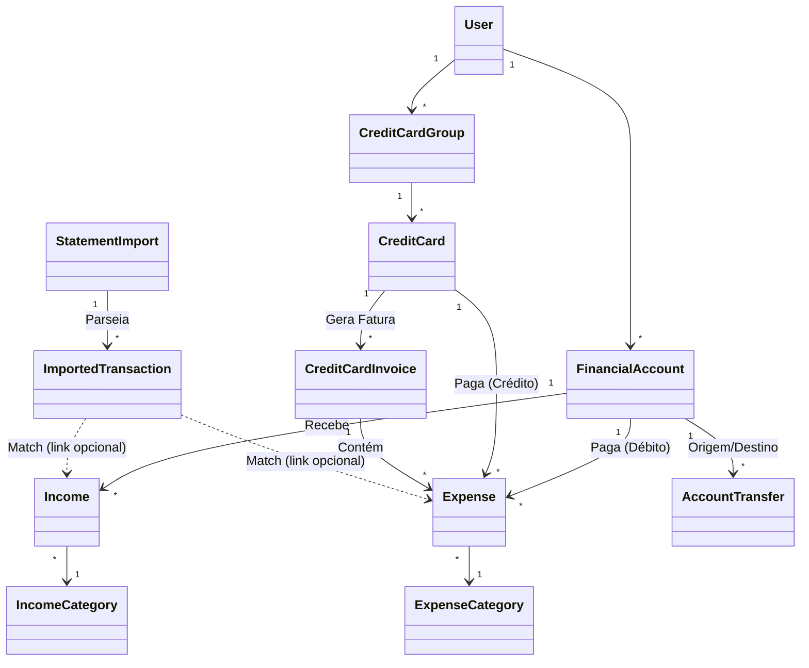

# 📄 Módulo Financeiro - DIAX CRM

Este documento descreve a arquitetura técnica, fluxo de dados e estrutura do módulo financeiro do DIAX CRM.

---

## 1️⃣ Visão Geral

O **Módulo Financeiro** é o núcleo de gestão de fluxo de caixa do DIAX CRM. Ele permite aos usuários gerenciar receitas, despesas, contas bancárias, cartões de crédito e conciliação bancária via importação de extratos/faturas.

**Objetivos Principais:**
- Rastreamento preciso de fluxo de caixa (Cash Flow).
- Gestão de cartões de crédito corporativos e pessoais.
- Conciliação bancária inteligente (Parsers de PDF/OFX).
- Relatórios de saúde financeira.

---

## 2️⃣ Estrutura Frontend (`crm-web`)

O frontend é construído em **Next.js 14+ (App Router)** utilizando **TailwindCSS** e **Shadcn/UI**.

### 📂 Estrutura de Pastas (`src/app/finance/`)

```
src/app/finance/
├── layout.tsx              # Layout base (Sidebar, Header financeiro)
├── page.tsx                # Dashboard/Sumário financeiro (Widgets rápidos)
├── accounts/               # Gestão de Contas Bancárias (CRUD)
├── categories/             # Gestão de Categorias (Receita/Despesa)
├── credit-cards/           # Gestão de Cartões e Faturas
├── expenses/               # Listagem e Edição de Despesas
├── incomes/                # Listagem e Edição de Receitas
├── imports/                # Módulo de Importação de Extratos (PDF/OFX)
└── transfers/              # Transferências entre contas
```

### 📄 Pages Principais

| Página | Rota | Responsabilidade | Components Chave |
|--------|------|------------------|------------------|
| **Dashboard** | `/finance` | Visão geral dos saldos e atalhos rápidos. | `FinanceStats`, `QuickActions` |
| **Receitas** | `/finance/incomes` | Listagem, filtro e exclusão de receitas. | `FinancialGrid`, `FinancialToolbar` |
| **Despesas** | `/finance/expenses` | Listagem de despesas (conta ou cartão). | `FinancialGrid`, `DeleteModal` |
| **Cartões** | `/finance/credit-cards` | Gestão de cartões, limites e faturas. | `CreditCardList`, `InvoiceList` |
| **Detalhes do Cartão** | `/finance/credit-cards/details?id={id}` | Faturas e despesas (Query Param para compatibilidade Export). | `CreditCardDetailsPage`, `FinancialGrid` |
| **Importação** | `/finance/imports` | Upload de extratos e conciliação (Match). | `StatementImportForm`, `TransactionMatcher` |

### 🧭 Navegação
Todas as páginas do módulo compartilham o `FinanceNav`, uma barra de navegação superior para acesso rápido a todas as seções (Receitas, Despesas, Cartões, etc.).

---

## 3️⃣ Camada de Serviços Client-Side (`finance.ts`)

O arquivo `src/services/finance.ts` centraliza a comunicação com a API. Ele define as **Interfaces (DTOs)** e os métodos `fetch`.

**Padrão Utilizado:**
- **Fetch Wrapper**: `apiFetch` (trata Auth headers e erros).
- **Tipagem Forte**: Interfaces TypeScript espelhando os DTOs do Backend.

### 🔌 Endpoints Principais

**Receitas (Incomes)**
- `GET /incomes?page=1&pageSize=10` (Paginação e Filtros)
- `GET /incomes/{id}`

**Despesas (Expenses)**
- `GET /expenses?creditCardId=...&creditCardInvoiceId=...` (Filtros Adicionais)
- `GET /expenses`
- `POST /expenses`
- `PUT /expenses/{id}`
- `DELETE /expenses/{id}`
- `POST /expenses/{id}/mark-paid`

**Contas e Cartões**
- `GET /financialaccounts`
- `GET /creditcards`
- `GET /creditcardgroups`
- `GET /creditcardinvoices/unpaid`

**Importação e Processamento**
- `GET /StatementImports`
- `POST /StatementImports/upload` (Upload Multipart)
- `POST /StatementImports/{id}/process` (Dispara processamento Async)

---

## 4️⃣ Backend – Estrutura de Domínio (`Diax.Domain.Finance`)

O domínio utiliza princípios de **DDD (Domain-Driven Design)** e **Rich Domain Models**.

### 📦 Entidades Principais

#### `FinancialAccount`
Conta "reais" (Bancária, Carteira, Investimento).
- **Propriedades**: `Name`, `Balance`, `InitialBalance`, `AccountType`.
- **Regra**: O saldo é atualizado a cada Receita/Despesa vinculada (exceto cartão).

#### `Income` (Receita)
Entrada de dinheiro.
- **Relacionamentos**: Pertence a uma `IncomeCategory` e `FinancialAccount`.
- **Regra**: Ao criar, incrementa o saldo da conta vinculada.

#### `Expense` (Despesa)
Saída de dinheiro.
- **Dualidade**: Pode ser paga via `FinancialAccount` (Débito) OU `CreditCard` (Crédito).
- **Relacionamentos**: `ExpenseCategory`, `FinancialAccount` (opcional), `CreditCard` (opcional).
- **Regra**: Se for Cartão, não afeta saldo da conta imediato, apenas soma na Fatura.

#### `CreditCard` & `CreditCardInvoice`
- **CreditCard**: Representa o plástico. Vinculado a um `CreditCardGroup` (Banco emissor).
- **CreditCardInvoice**: Fatura mensal. Agrupa `Expenses` de um período.

#### `StatementImport` & `ImportedTransaction`
- Representa um arquivo (PDF/OFX) subido pelo usuário.
- Contém N transações importadas que precisam de "Match" com o sistema.

---

## 5️⃣ Application Layer (`Diax.Application.Finance`)

Contém a lógica de orquestração (Use Cases) e DTOs.

- **Services**: `IncomeService`, `ExpenseService`, `StatementImportService`.
- **Validações**: Verifica se a conta pertence ao usuário, se tem saldo (se regra ativa), e consistência de dados.
- **Transações**: Usa `IUnitOfWork` para garantir atomicidade (Ex: Criar Receita + Atualizar Saldo).

---

## 6️⃣ Infrastructure Layer (`Diax.Infrastructure`)

### Configurações EF Core
- Mapeamento via `IEntityTypeConfiguration<T>`.
- Conversão automática de `snake_case` para tabelas e colunas.
- **Global Query Filters**: Filtra automaticamente por `UserId` (`IUserOwnedEntity`) para garantir Multi-tenancy.
  - *Nota*: Repositórios usam `.IgnoreQueryFilters()` em casos específicos de admin ou debug, mas a segurança padrão é ativa.

### Repositórios
- Implementam `Repository<T>` genérico.
- **Overrides**: Métodos como `GetPagedAsync` são sobrescritos para incluir relacionamentos (`.Include()`) necessários para a UI (ex: Nome da Categoria, Nome da Conta).

---

## 7️⃣ Relacionamentos do Banco

Esquema simplificado dos relacionamentos:



---

## 8️⃣ Fluxos Críticos

### A. Criação de Despesa (À Vista)
1. Frontend envia `POST /expenses`.
2. `ExpenseService` valida permissões.
3. Cria entidade `Expense` com `PaymentMethod = Cash`.
4. Carrega `FinancialAccount`.
5. Executa `account.Debit(amount)`.
6. Salva ambos via `UnitOfWork`.

### B. Importação de Extrato PDF
1. Usuário envia PDF via `POST /StatementImports/upload`.
2. Backend salva arquivo temporário ou em Blob Storage.
3. `PdfFileParser` (com ou sem IA) extrai texto.
4. Regex/IA identifica Data, Descrição e Valor.
5. Cria `StatementImport` com status `Processing`.
6. Cria N registros de `ImportedTransaction`.
7. Retorna Preview para o usuário confirmar/categorizar.

---

## 9️⃣ Segurança

- **Autenticação**: JWT Bearer Token.
- **Escopo de Dados**:
  - Implementação de `IUserOwnedEntity` em todas as entidades financeiras.
  - `DiaxDbContext` aplica filtro global `x => x.UserId == CurrentUser.Id`.
  - Isso impede vazamento de dados entre usuários (Multi-tenant lógico).

---

## 🔟 Pontos de Extensão Futura

1.  **Integração Open Finance**: Conectar diretamente com APIs bancárias (Pluggy/Belvo) para evitar upload manual.
2.  **Orçamentos (Budgets)**: Definir limites de gastos por Categoria/Mês.
3.  **Fluxo de Caixa Projetado**: Usar despesas recorrentes e parceladas para prever saldo futuro.
4.  **Dashboard BI**: Gráficos avançados de evolução patrimonial.
5.  **Conciliação Automática**: Rotina noturna para tentar "dar match" automático entre Importações e Lançamentos Manuais.
